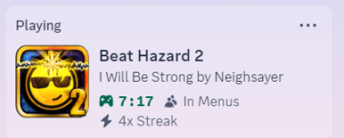

# BH2Discord

BH2Discord is a lightweight Discord Rich Presence integration for Beat Hazard 2.  
It displays your current song, game section, live stats, and AFK status directly on your Discord profile.

This project was officially approved by the creator of Beat Hazard 2, Cold Beam Games Ltd.



---

## Installation

**Enable Discord Integration in Beat Hazard 2**

Before launching BH2Discord, you **must** enable Discord Rich Presence in the game’s launch options:

- Open **Steam**
- Right-click on **Beat Hazard 2** → **Properties**
- Under **Launch Options**, add:
```
-discord
```

> This is required. BH2Discord will not function unless `-discord` is enabled in the game’s launch options.

**Download and Extract**

- Go to the [Releases](https://github.com/Mayo525/BH2Discord/releases) page  
- Download the latest `BH2Discord.zip`  
- Extract the zip file to any folder

**Run the Programs**

- Start **Beat Hazard 2** first  
- Then run `BH2Discord.exe` from the folder you extracted it to  

> If you run BH2Discord before the game, it may crash.

---

## Features

- Shows the currently playing song  
- Displays what section of the game you're in (menu, gameplay, results, etc.)  
- Detects when you're AFK after alt-tabbing  
- Updates live stats like combo, score, songs, and time  
- No setup or configuration required  

---

## Requirements

Make sure the following components are installed before running BH2Discord:

- [.NET Framework (Latest Version)](https://dotnet.microsoft.com/en-us/download/dotnet-framework)  
- [Visual C++ Redistributables – All Versions (2010–2022)](https://learn.microsoft.com/en-us/cpp/windows/latest-supported-vc-redist)

---

## Troubleshooting

If the program fails to run and shows errors about missing DLL files, here’s how to fix them:

### Common Errors & Fixes

- **"Cannot run the code due to `VCRUNTIME140_1D.dll` missing"**  
- **"Cannot run the code due to `MSVCP140D.dll` missing"**  
- **"Cannot run the code due to `ucrtbased.dll` missing"**

**Solutions:**

- Install or repair the **Visual C++ Redistributables** and **.NET Framework** listed above.
- If the issue persists:
  - Manually download each missing `.dll` file shown in the error message.
  - Copy them to:  
    - `C:\Windows\System32` (for 64-bit systems)  
    - `C:\Windows\SysWOW64` (for 32-bit systems)

> This is a fallback method only. Always try installing the official runtime packages first.

---

## Support

If you run into problems or want to request a feature, open an issue on the [GitHub Issues page](https://github.com/Mayo525/BH2Discord/issues).
